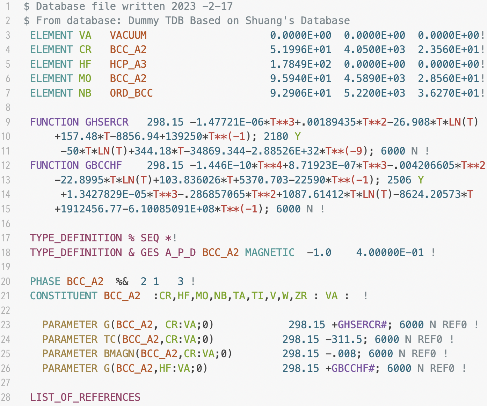
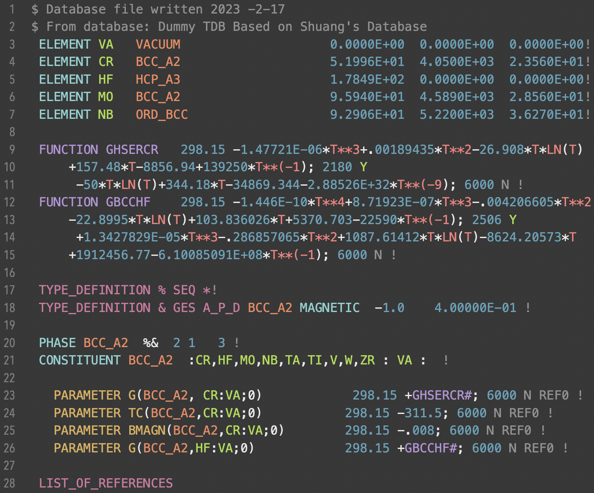
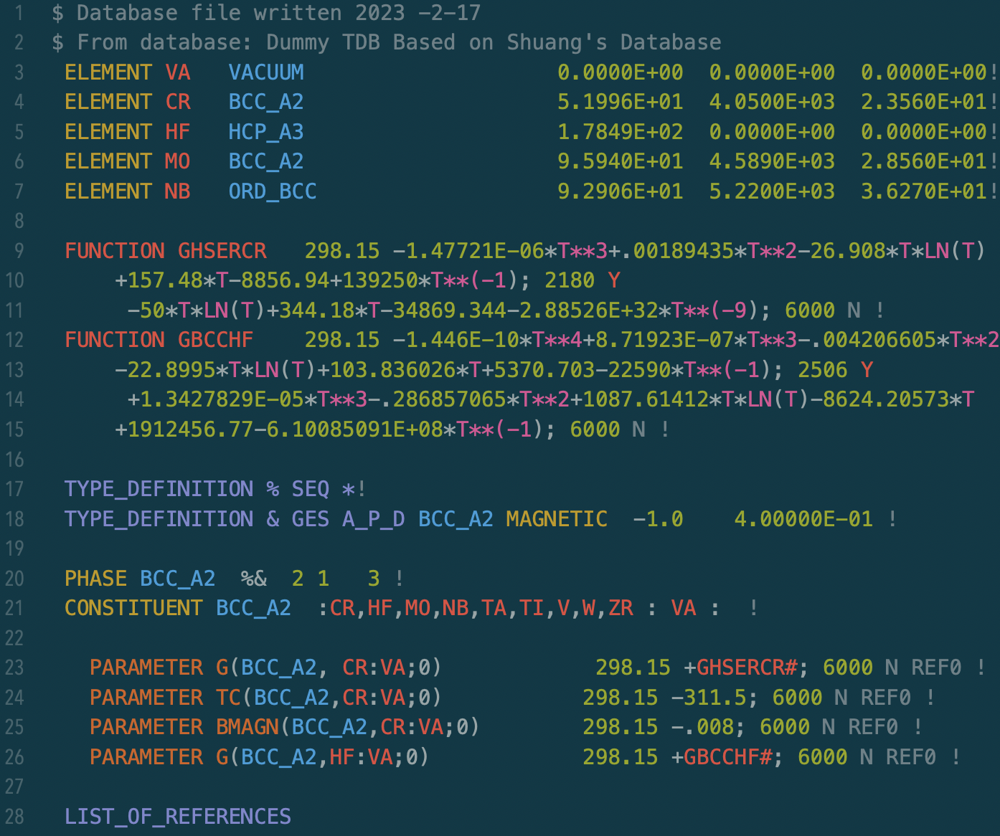
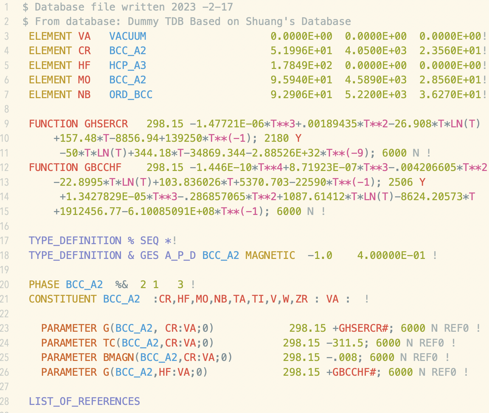
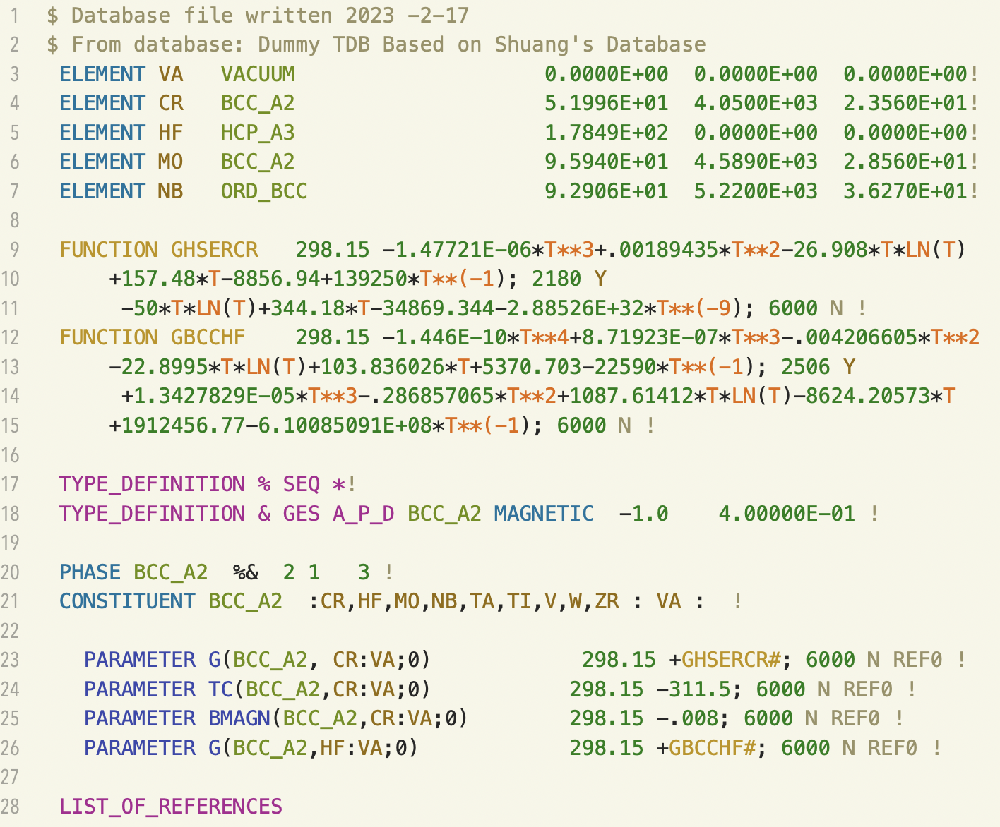

# TDB Highlighter For CotEditor

## Introduction
The CotEditor is a _very_ lightweight _native_ editor for macOS written in Swift, which I use to quickly look-up and edit files with syntax highlighting but without the overhead of a full IDE. 

It is a free, open-source software, and super fast to get started with. There is a one-click install available through the [Mac App Store](https://itunes.apple.com/us/app/coteditor/id1024640650?mt=12) and on [GitHub](https://github.com/coteditor/CotEditor/tree/main).

## Installation

Adding the TDB highlighter to CotEditor is easy too! Simply:
1. Download the `TBD.yml` file from this folder.
2. Open CotEditor and go to `Settings` > `Format`. Then, at the bottom of `Avaialble syntaxes:` list, click the `(...)` to open the dropdown menu, and finally click `Import...`.
3. Select the `TBD.yml`, click `Import`, and you're done! Now, every time you open a `.tbd`/`.TDB` file, it will be syntax highlighted.

## Examples

> Note: Works very well with most themes. We recommended either *one of the 5 examples below*, as well as *Dendrobates Light*, *Dentrobates Dark*, *Printen*, *Resinifictrix*, and *Pulse*. Subpar results are produced with Mono, Kawazu, Lakritz, Classic, thus these are not recommended.

### Anura (Default Light)

### Anura Dark (Default Dark)

### Solarized Dark

### Solarized Light

### Note

