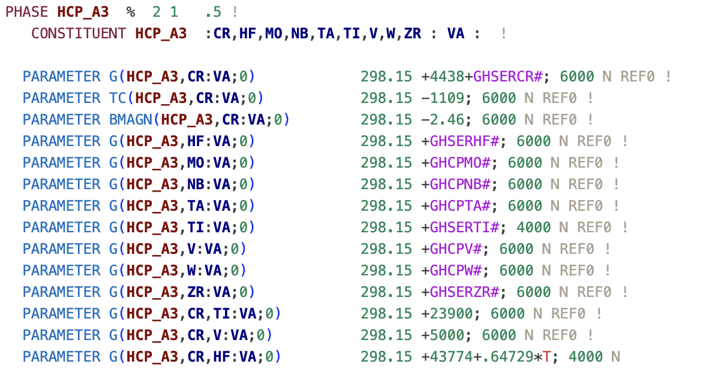
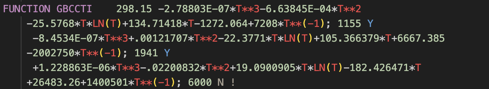

# TDB Highlighter

_You didn't know you can't do CALPHAD without it._

This VS Code Language Extension, developed by Adam M. Krajewski in [Prof. Zi-Kui Liu's group](https://phaseslab.org) at The Pennsylvania State University, provides syntax highlighting for the Thermodynamic DataBase (TDB) files used in the [CALPHAD community](https://calphad.org) to describe thermodynamic properties of materials. You can find them alongside publications in the [CALPHAD Journal](https://www.sciencedirect.com/journal/calphad) published by Elsevier, or in the [Thermodynamic DataBase DataBase (TDBDB)](https://avdwgroup.engin.brown.edu) maintained by Prof. van de Walle group at Brown University.

**Most critically, if something is highlighted differently than you expect, you know something may be wrong with it :).** E.g., in `+1.95033E-07*T**3-.01798O876*T**2+78.5244752*T*LN(T)-722.59722*T+229382.886-93813648*T**(-1); 3290 Y` one of the numbers is not a number and will be red. Guess which one...? Likewise, that `LAVE_C36` phase you just typed will stand out.

## Features

- **Phases, species, elements** and other critical elements of the database, are formatted with highly visible fonts and colors, speeding up the process of navigating, reading, and editing the files tremendously.

- **References, notes, comments, optionals,** and otherwise less critical parts of the database, are formatted with subtle formatting to reduce visual clutter.

- **Temperature (T) and its powers/logs/exps** in equations are formatted with bright red colors to immediately pinpoint where a given part of the polynomial is located.

- **Function names** are exposed within the equations to make them stand out from numbers and be easier to read.

- A number of **TDB syntax** keywords are specifically highlighted in neutral colors matching their functions to make them stand out in case of typos.

***Giving raise to the following neat-looking TDB header and function definitions:***

***and main body with thermodynamic model parameters:***

***Oh! And it works in the dark mode, too!***

## FAQ

***No known _errors_ at this time!*** But in some cases listed below, the highlighting may not be perfect due to the arbitrary nature of the TDB files.

### User-Defined Phases
The phase highlighting is not perfect in a way that it will not cover all the cases since names are arbitrary and can be anything. They are currently (V1.0.0) covered by this regex (where `\\w*` can be interpreted as "any characters remaining"):

    "\\b(ELECTRON_GAS|VACUUM|GAS|LIQUID|FCC\\w*|BCC\\w*|HCP\\w*|DHCP|CBCC\\w*|DOUBLE\\w*|DIA\\w*|DIAMOND\\w*|BCT\\w*|RHO\\w*|ORTHORHOMBIC\\w*|TETRAGONAL\\w*|LAVES\\w*|CEMENTITE\\w*|SIGMA\\w*|MU\\w*|LAMBDA\\w*|ETA\\w*|BETA\\w*|GRAPHITE\\w*|THETA\\w*|GAMMA\\w*|C14|C15|C36|ORT|AMORPHOUS\\w*|\\w*AMORPHOUS|\\w*ALPHA|\\w*PRIME|\\w*BETA|\\w*GAMMA|\\w*DELTA|\\w*EPSILON|\\w*ETA|\\w*MU|\\w*SIGMA|\\w*TAU|\\w*D019|\\w*D83|\\w*A\\d\\d)\\b"

if you want to add something to it, please do so in the `tdb.tmLanguage.json` file, edit the regex string above to add your case, and **please open a pull request** in this repository.

### Names of Species

Similar to phases, species names can be arbitrarily set by users, but in this case, the number is so large that it is not feasible to cover them all _a priori_. If you wish to highlight your species, please add them to your **local** phases list.

### Line Lenght Limit

Some software, like the very popular [Thermo-Calc](https://www.thermocalc.com), has a limit on the length of a line in the TDB file, which is 80 characters following the legacy of [Fortran standard](https://en.wikipedia.org/wiki/Fortran_95_language_features#Source_code_formatting). We do not enforce this limit in the syntax highlighting, as not all software has this limit (e.g. [pycalphad](https://pycalphad.org)).

However, if you wish to enforce this limit, you can quickly do so by adding the following to your user `settings.json` file in VS Code:

    "editor.rulers": [80]

## Selected Release Notes

### 1.0.0

The initial release of TDB Highlighter.

***Enjoy!***
