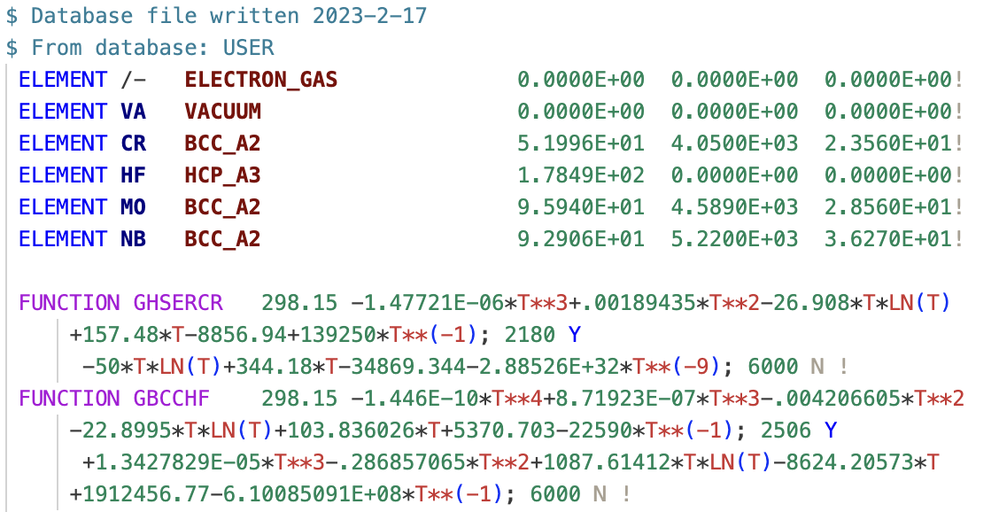
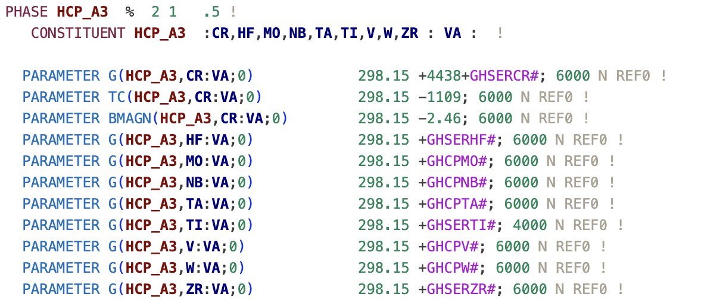
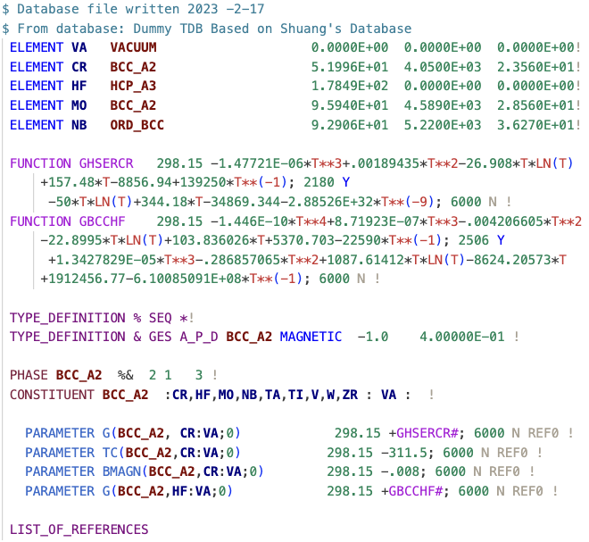

# TDB Highlighter

_You didn't know you can't do CALPHAD without it._

This VS Code Language Extension, developed by [Adam M. Krajewski](https://github.com/amkrajewski) in [Prof. Zi-Kui Liu's group](https://phaseslab.org) at The Pennsylvania State University, provides syntax highlighting for the Thermodynamic DataBase (TDB) files used in the [CALPHAD community](https://calphad.org) to describe thermodynamic properties of materials. You can find them alongside publications in the [CALPHAD Journal](https://www.sciencedirect.com/journal/calphad) published by Elsevier, or in the [Thermodynamic DataBase DataBase (TDBDB)](https://avdwgroup.engin.brown.edu) maintained by Prof. van de Walle group at Brown University.

**Most critically, if something is highlighted differently than you expect, you know something may be wrong with it :).** E.g., in `+1.95033E-07*T**3-.01798O876*T**2+78.5244752*T*LN(T)-722.59722*T+229382.886-93813648*T**(-1); 3290 Y` one of the numbers is not a number and will be red. Guess which one...? Likewise, that `LAVE_C36` phase you just typed will stand out.

## Features

- **Phases, species, elements** and other critical elements of the database, are formatted with highly visible fonts and colors, speeding up the process of navigating, reading, and editing the files tremendously.

- **References, notes, comments, optionals,** and otherwise less critical parts of the database, are formatted with subtle formatting to reduce visual clutter.

- **Temperature (T) and its powers/logs/exps** in equations are formatted with bright red colors to immediately pinpoint where a given part of the polynomial is located.

- **Function names** are exposed within the equations to make them stand out from numbers and be easier to read.

- A number of **TDB syntax** keywords are specifically highlighted in neutral colors matching their functions to make them stand out in case of typos.

***Together, they yield the following neat-looking TDB header and function definitions:***

***and the main body of thermodynamic model parameters:***

***Oh! And it works in the dark mode, too!***

We have tested that it performs very well with a number of themes, including: **(VSCode Default) Light Modern, Quiet Light, Solarized Light, Monokai, Monokai Dimmed, Synthwave '84, and (VSCode Default) Dark Modern**. You can see some of the [example renderings below](#example-renderings). If you find that TDB Highlighter does not work well with your theme, please open an issue in this repository and we will try to fix it.

## FAQ

***No known _errors_ at this time!*** However, in some cases listed below, the highlighting may not be perfect due to the arbitrary nature of the TDB files and the limitations of the approach.

### User-Defined Phases
The phase highlighting is not perfect in a way that it will never cover all the cases since names are arbitrary user choices and can be any string. Thus, without _interpreting_ the TDB file (as opposed to _lexing_ it like we do here), it is impossible to know what is a phase in every context. 

Thus, we rely on a list of **common phase name *patterns*** that are known to be used in the community. They are currently (as of V1.2.0) covered by this regex (where `\\w*` can be interpreted as "any characters remaining in word", `\\d` is any digit, and `|` is "or" operator):

    "\\b(ELECTRON_GAS|VACUUM|GAS|LIQUID|IONIC_L\\w*|FCC\\w*|BCC\\w*|HCP\\w*|DHCP|CBCC\\w*|DELTA|DOUBLE\\w*|DIA\\w*|DIAMOND\\w*|BCT\\w*|RHO\\w*|ORTHORHOMBIC\\w*|TETRAGONAL\\w*|LAVES\\w*|CEMENTITE\\w*|SIGMA\\w*|MU\\w*|LAMBDA\\w*|ETA\\w*|BETA\\w*|GRAPHITE\\w*|THETA\\w*|GAMMA\\w*|C14|C15|C36|ORT|R_PHASE|AMORPHOUS\\w*|\\w*_AMORPHOUS|\\w*_FCC|\\w*_BCC|\\w*_HCP|\\w*_BCT|\\w*_ALPHA|\\w*_PRIME|\\w*_BETA|\\w*_GAMMA|\\w*_DELTA|\\w*_EPSILON|\\w*_ETA|\\w*MU|\\w*_SIGMA|\\w*_TAU|\\w*_D019|\\w*_D83|\\w*_A\\d|\\w*_A\\d\\d|\\w*_B\\d|\\w*_B\\d\\d|\\w*_C\\d|\\w*_C\\d\\d|\\w*_D\\d|\\w*_D\\d\\d|\\w*_E\\d|\\w*_E\\d\\d|\\w*_H\\d|\\w*_H\\d\\d|\\w*_L\\d|\\w*_L\\d\\d|\\w*_S\\d|\\w*_S\\d\\d)\\b"

You will notice all compound-based names (both explicit `NACL` and anonymous `M23C6`) are not covered and this is by design, due to both practical and fundamental issues using such ambiguous names can introduce, even though they are very convenient and commonly used. At the same time, you can quickly adjust this by appending it explicitly with Strukturbericht designation, e.g. `NACL_B2` or `CR23C6_D84`, and everything will work as expected.

If you believe something is missing, please open an issue in this repository where you secify the phase name you wish to recognize and we will try to add it. 

If you wish to add something yourself, **unsolicited pull requests are very welcome**. To do so, adjust regexes in the `tdb.tmLanguage.json` file and open a pull request.

### Names of Species

Similar to phases, species names can be arbitrarily set by users, but in this case, the number is so large that it is not feasible to cover even the common ones, as even the same ion can be found written differently across research groups; e.g., `Fe3+`, `Fe+3`, `3+Fe`, `3Fe`, etc. 

If you wish to highlight your species, please add them to your **local** phases list and avoid opening a pull request for this.

### Line Lenght Limit

Some software, like the very popular [Thermo-Calc](https://www.thermocalc.com), has a limit on the length of a line in the TDB file, which is 80 characters following the legacy of [Fortran standard](https://en.wikipedia.org/wiki/Fortran_95_language_features#Source_code_formatting). We do not enforce this limit in the syntax highlighting, as not all software has this limit (e.g. [pycalphad](https://pycalphad.org)).

However, if you wish to enforce this limit, you can quickly do so by adding the following to your user `settings.json` file in VS Code:

    "editor.rulers": [80]

## Example Renderings

### Light Modern (VSCode Default Light)

### Quiet Light

### Solarized Light

### Monokai

### Monokai Dimmed

### Synthwave '84

### Dark Modern (VSCode Default Dark)

## Selected Release Notes

### 1.0.0
- The initial release of TDB Highlighter.

### 1.0.0 - 1.2.1
- Several user-requested features were added and some small bugs have been fixed.

### CotEditor
- TDB Highlighter is now available for [**CotEditor**](https://coteditor.com) as well! For details, please see [this TDB Highlighter release](https://github.com/amkrajewski/tdb-highlighter/releases/tag/CotEditor).

***Enjoy!***
